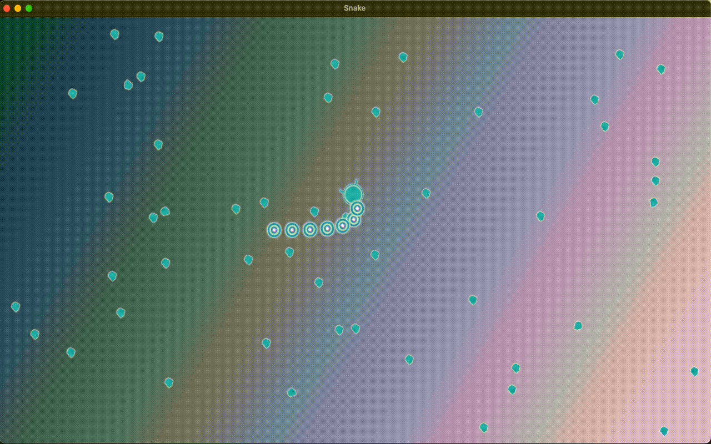

# Snake (kinda)



A simple snake-like "game" using [Bevy](https://bevyengine.org/).

This is part of my journey of learning Rust, trying to get the basics right. I'm also following a very good book, [Rust in Action](https://www.manning.com/books/rust-in-action), which elaborates on advanced concepts and things about the language.

## How to run it?

If your environment is setup for rust:

```
cargo run
```

Otherwise, you can play on your browser [here](https://ganitzsh.github.io/snake).

## Rules

* Eat the food
* You cannot loose (yet)

Every time you eat, the speed increases. It is possible to eat yourself, which will result in losing the segments of the body that were below the eaten parts and slow down accordingly.

## Controls

* Left arrow: rotates the head counter clockwise
* Right arrow: rotates the head clockwise

# Things I might add

* A way to loose (poisonous food, enemies of some sort, not sure yet)
* Some nice sounds
* Display of the score
